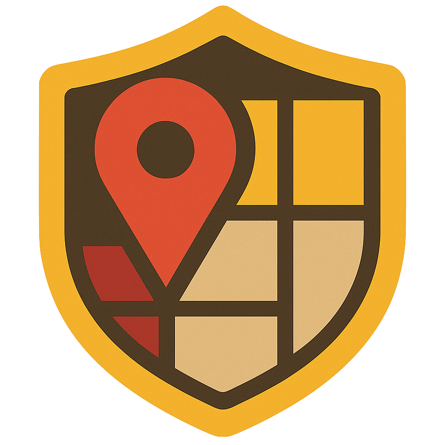
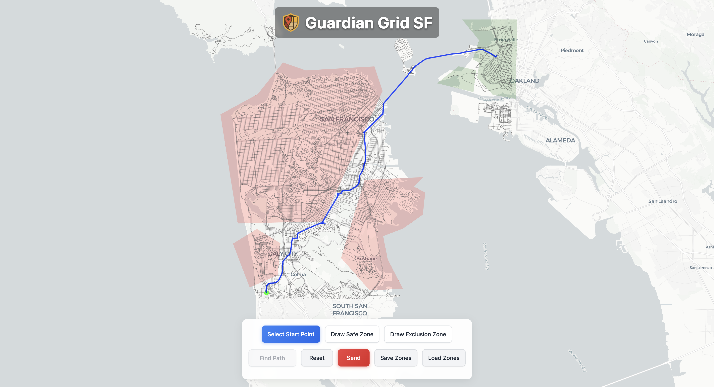

<p align="center">
    
</p>

<h1 align="center">Guardian Grid</h1>

[LinkedIn Post](https://www.linkedin.com/feed/update/urn:li:activity:7323027994569015298/) • [Demo Video](https://www.youtube.com/watch?v=pHRag0iRaTI) • [Hackathon Details](https://cerebralvalley.ai/e/national-security-hackathon-5a6fa1dc)

## About

Guardian Grid (SF) is a smart city emergency evacuation tool that helps communities respond quickly and safely during major disasters. The system allows city administrators or emergency officials to mark danger zones, such as areas affected by natural disasters, and define safe zones directly on an interactive map. Advanced path finding algorithms are then used to generate and communicate the safest evacuation routes for residents, taking current hazards into account.

When an emergency takes place, officials can update danger and safe areas and immediately send alerts to residents' phones via text message. Each person receives a link to a web portal, which uses their current location to display a danger-aware route to safety and provides instant directions with [Google Maps](https://www.google.com/maps/). As situations evolve, routes are recalculated in real time, and new alerts are sent to keep everyone updated and safe. Check out the demo for this project [HERE](https://www.youtube.com/watch?v=pHRag0iRaTI).

<p align="center">
    
</p>

In the current demonstration code, alerts are sent via SMS to a single phone number for demo and testing purposes. However, in a real deployment Guardian Grid SF would integrate with the [Wireless Emergency Alerts (WEA) system](https://www.fcc.gov/consumers/guides/wireless-emergency-alerts-wea) to broadcast evacuation alerts to all people in the affected city or region.

While the present focus is on the San Francisco Bay Area, our vision is to expand Guardian Grid to other major cities around the world. Our goal is to provide a robust system for coordinated and data-driven evacuations so that every city can protect its people, minimize congestion, and respond quickly as emergencies unfold.

## Team Aspen

This project was created by **Team Aspen** at the National Security Hackathon:

- [Ioana Munteanu](https://www.linkedin.com/in/ioana-munteanu/)
- [Christina Huang](https://www.linkedin.com/in/christina-sh-huang/)
- [Mehmet Yilmaz](https://www.linkedin.com/in/mehmet-yilmaz/)
- [Dylan Eck](https://www.linkedin.com/in/dylaneck/)

We are grateful for the guidance and support from mentors and organizers, including Elliott Wolf, Adam Papa, and Ray Del Vecchio.

<p align="center">
  <table>
    <tr>
      <td></td>
      <td></td>
    </tr>
  </table>
</p>

## Hackathon Details

<p align="center">
    
</p>

Guardian Grid (SF) was built at the 2nd annual **National Security Hackathon** (April 26-27, 2025), hosted by Cerebral Valley and Shield Capital in partnership with Stanford DEFCON. The event brought together technologists and engineers to build solutions for national security problem statements curated by US military stakeholders, with guidance from government, military, and startup mentors.

- The weekend included a defense tech career fair and team-building at Stanford University, followed by 24 hours of hacking in San Francisco.
- Sponsors and supporters included Shield Capital, In-Q-Tel, NATO Innovation Fund, Vannevar Labs, Scale AI, Groq, Windsurf, Anthropic, Microsoft, Maxar, Dedrone, Distributed Spectrum, and Code Metal.
- Hackathon categories included Smart Cities, War Games, Maritime Pattern Analysis, Cybersecurity for AI Deployments, Radio Frequency Navigation, General National Security, and Hack A Refrigeration System.

The main section of the hackathon had prizes that included included $3,000 and Starlink units for first place, $2,000 for second place, and $1,000 for third place. But there was a special, hidden, prize for a refrigeration challenge with a prize of $5,000.

Our team entered both the **Smart Cities** and **Hack A Refrigeration System** challenges. Guardian Grid (SF) was our Smart Cities entry. We earned a $5,000 Special Prize and Honorable Mention for our technical work in the refrigeration challenge, and our Smart Cities solution received strong feedback from judges and peers alike.

Judges and peers recognized Guardian Grid (SF) as an impactful response to a significant problem in emergency management, praising its creativity, practical approach, and the fact that it avoided simply using LLM technology as a catch-all solution. Although our Smart Cities project did not win a top-three prize due to time constraints from splitting resources between two challenges, the judges were impressed by its potential and relevance. Our team was honored to receive this recognition along with winning the **Hack A Refrigeration System** challenge.

Find more details and reflections in our [LinkedIn post](https://www.linkedin.com/feed/update/urn:li:activity:7323027994569015298/) and checkout the photo gallery from the hackathon [here](https://cerebralvalley.pixieset.com/nationalsecurityhackathon/).

## GPS Data Sources

For our path finding and mapping in the San Francisco Bay Area, we required precise and comprehensive roadway data. We initially experimented with both Google Maps API and Mapbox's API to retrieve this data. However, their licensing restrictions and functional limitations prevented us from obtaining or using the underlying routing graph in a way that matched our hackathon goals. Because of these constraints, we used open raw geographic datasets. We got this raw geographic data though these two open-source sources:

- [San Francisco Bay Region Roadways (MTC Open Data Portal)](https://opendata.mtc.ca.gov/datasets/MTC::san-francisco-bay-region-roadways/about)
- [Explore San Francisco Bay Region Roadways](https://opendata.mtc.ca.gov/datasets/MTC::san-francisco-bay-region-roadways/explore?location=37.799654%2C-122.077536%2C8.64)

Linear features represent roadways for the San Francisco Bay Region. The feature set was assembled using all county-based 2021 TIGER/Line shapefiles by the Metropolitan Transportation Commission (MTC/ABAG). The dataset includes all primary, secondary, local neighborhood, and rural roads, city streets, vehicular trails, ramps, service drives, alleys, private roads, bike paths, bridle/horse paths, walkways, pedestrian trails, and stairways for the entire region.

- The feature set contains unique road segments for each county and includes cases where a single stretch of road has multiple designations (e.g., an interstate being called by its number and local name).
- Primary roads are major divided highways, while secondary roads are main arteries in the region.
- The dataset includes attribute columns for identifying road type, jurisdiction, and more, supporting flexible routing and data analysis.

You can read more about the licensing and data details at the [MTC dataset source](https://opendata.mtc.ca.gov/datasets/MTC::san-francisco-bay-region-roadways/about).

## How To Run

1. Clone this repository and navigate into it.

2. Set up your `.env.local` file. Refer to the `env.local.example` file to learn what environment variables you need. Note that you will need a [MapBox API key](https://www.mapbox.com/) for the map UI and geocoding, a [TextBelt API key](https://textbelt.com/) for SMS alerts (demo only), as well as a phone number for texting during the demo.

3. After you create your `.env.local` file, you can start setting up all of GuardianGrid's services, which include:

   - **frontend**: The app's frontend interface.
   - **backend**: The app's backend, including map pathfinding logic.

4. To set up the **frontend** service, ensure you have [Yarn](https://classic.yarnpkg.com/en/docs/getting-started) installed and run:

   ```bash
   yarn install
   ```

5. To set up the **backend** service, do the following:

   ```bash
   # go into this directory
   cd ./src/backend

   # set up a python environment
   python3 -m venv env

   # activate the python environment
   source env/bin/activate

   # install dependencies
   pip3 install -r requirements.txt

   # deactivate python environment
   deactivate

   # return to the project's root directory
   cd -
   ```

6. With everything set up, the final step is to run the app. You'll need two separate terminal windows or tabs, referred to as "Terminal #1" and "Terminal #2".

7. In "Terminal #1", start the **backend** service:

   ```bash
   # go into the backend service directory
   cd ./src/backend

   # activate the python environment
   source env/bin/activate

   # run the backend
   bash ./run.sh
   ```

8. In "Terminal #2", start the **frontend** service:

   ```bash
   yarn dev
   ```

9. With everything running, open your browser and go to: http://localhost:3000/

10. When finished, close "Terminal #1" and "Terminal #2".
